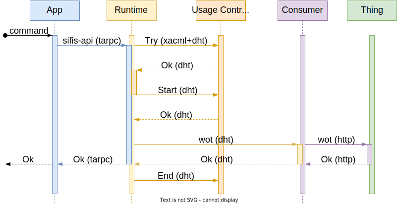

# sifis-message

[SIFIS-Home](https://sifis-home.eu) developer API runtime and WoT consumer through DHT messages

## Programs

### `sifis-runtime`

It is a SIFIS-Home developer API runtime implementation that uses the DHT as a mean to interact
with the [usage-control](https://github.com/sifis-home/usage-control) system to control SIFIS-Home
Web of Things NSSDs via a distributed consumer.

### `sifis-consumer`

Reference implementation of a Web of Things consumer interacting with the SIFIS-Home developer API
runtime.

